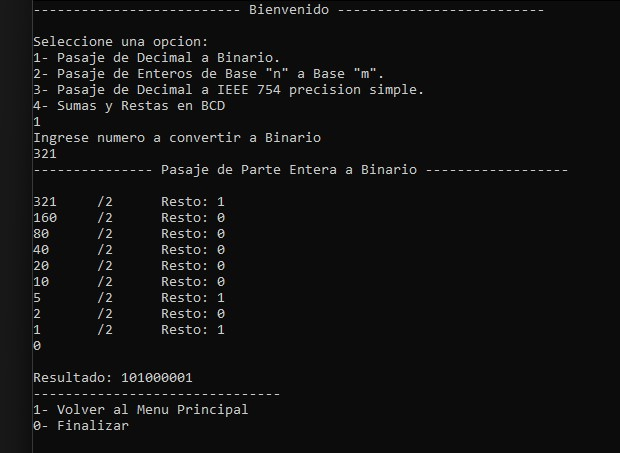
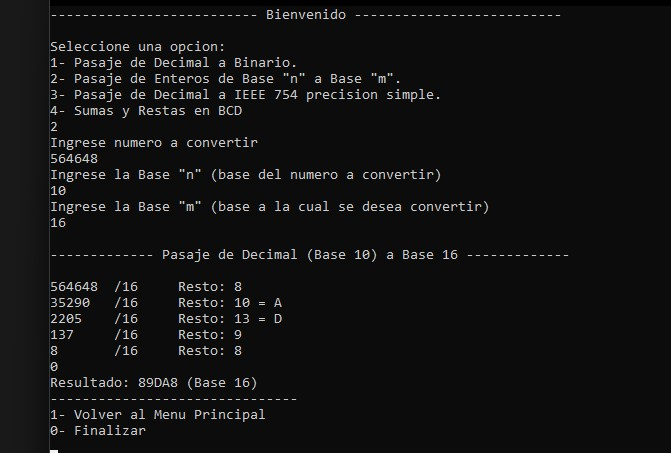
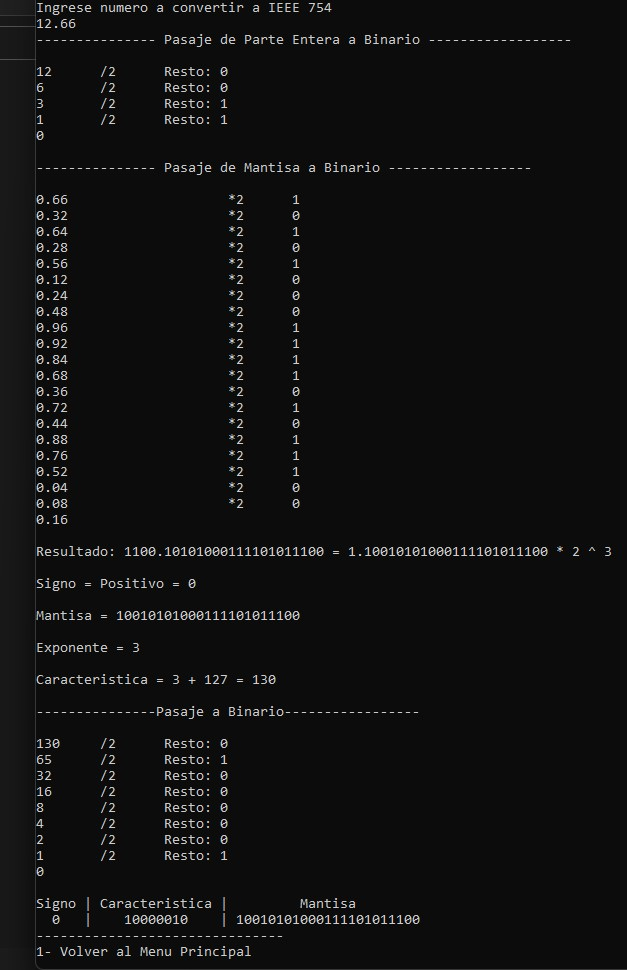
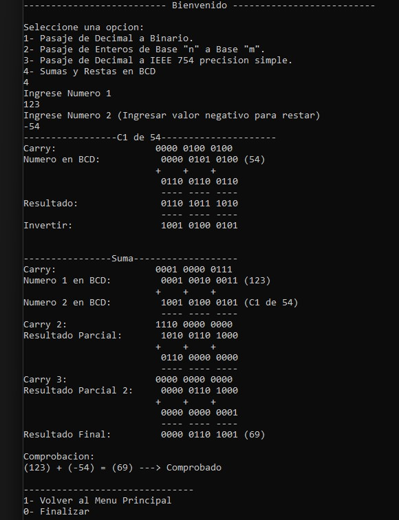

# Computer Architecture Helper

Este programa lo realicé en 2020 con C++ para resolver ejercicios de la materia Arquitectura de Computadoras y poder comprobar que mis resultados sean los correctos.

### El programa resuelve paso por paso:

1. Pasajes de Decimal a Binario.
2. Pasaje de ENteros de Base "n" a Base "m".
3. Pasaje de Decimal a IEEE 754 presición simple
4. Sumas y Restas en BCD

### Modo de Uso:

Interfaz de Consola, abra el ejecutable "ComputerArchitectureHelper.exe" y escriba el número de la opción que quiere. Posteriormente el programa lo guiará para que ingrese los números requeridos y le mostrara el resultado y la resolución paso por paso.

### Screenshots:

